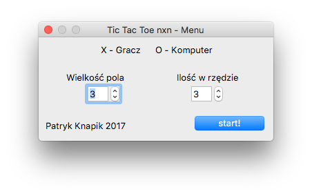
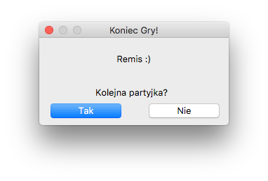
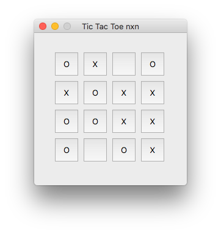

# Qt Tic-Tac-Toe
*Old and dirty project*

Simple Tic-Tac-Toe Game written in C++ with Qt GUI.
Game was first developed for terminal only, so it can work in terminal after minor changes.
Game uses Min-Max algorithm with Alpha-Beta pruning with some tricks like:
- First computer move is random
- Computer can search for in-row setup to prevent user from winning (for larger games)
- And something more that i forgot..

It needs some time to calculate when game is large, please be patient.

Some random screenshots:

*for PAMSI lab on PWR*
